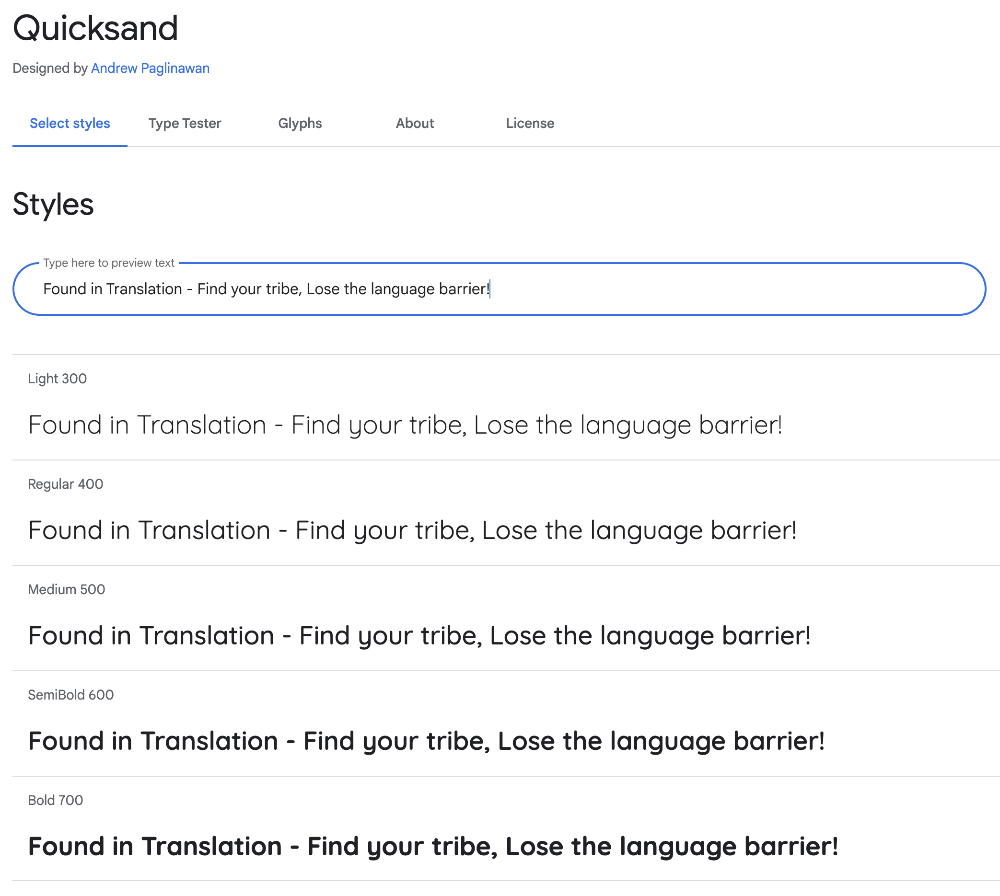
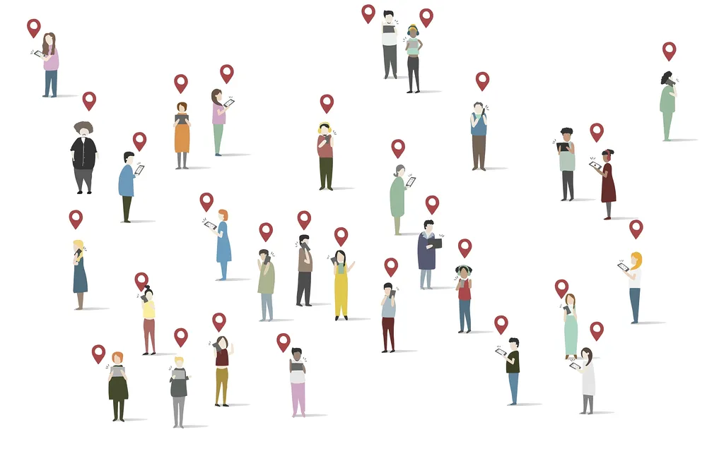

# **FOUND IN TRANSLATION**

Find your tribe, lose the language barrier

[View deployed site]()
# **The Team**
[Team Members](#team-members)

# **Table of Contents**   
1. [UX Development](#ux-development)
    * [PROJECT GOAL](#project-goal) 
        * [Business Goals](#business-goals)
      
    * [USER STORIES](#user-stories)
        * [New User](#new-user)
        * [Registered Users/Returning Users](#registered-user-or-returning-users)
        * [Admin User](#admin-user)
        * [Target Audience](#target-audience)

   * [RESEARCH](#research)

   * [DESIGN](#design)
        * [Colour Scheme](#colour-scheme)
        * [Typography](#typography)
        * [Imagery](#imagery)
        * [Wireframes](#wireframes)
        * [Database Structure](#database-structure)

      
2. [Features](#features)  
    * [EXISTING FEATURES](#existing-features) 
        * [General Features On All Pages](#general-features-on-all-pages)
        * [Features Of Each Page](#features-of-each-page)
        * [Features To Implement In Future](#features-to-implement-in-future)
        * [Privacy Page and Terms and Conditions Page](#privacy-page-and-terms-and-conditions-page)

      
3. [Technology Used](#technology-used)  
    * [Language Used](#language-used) 
    * [Frameworks,libraries and Program Used](#frameworkslibraries-and-program-used)  
   
4. [Testing](#testing)   
    * [TESTING.md](#testing)   

5. [Deployment](#deployment)  
    * [Deployment Heroku](#deployment-to-heroku) 
    * [Steps To Use This Project](#steps-to-use-this-project)  

6. [Credits](#credits)  
    * [Content](#content) 
    * [Media](#media)  
 
7. [Acknowledgements](#acknowledgements)  

    

# **The Team**
## **Team Members**

* Andrew Dempsey [LinkedIn](https://www.linkedin.com/in/andrew-dempsey-20ab40180/) / [Github](https://github.com/andrewdempsey2018)
* Cristian B.    [LinkedIn](https://www.linkedin.com/in/cristianbuca/) / [Github](https://github.com/CristianBuca)
* Didi           [LinkedIn](https://www.linkedin.com/in/onyema-onyejekwe-492128102/) / [Github](https://github.com/Didisimmons)
* Kera Cudmore   [LinkedIn](https://www.linkedin.com/in/keracudmore/) / [Github](https://github.com/kera-cudmore)
* Paula Silva    [LinkedIn](https://www.linkedin.com/in/paulacgsilva) / [Github](https://github.com/paulasdev) 

# **UX Development**   

## **PROJECT GOAL**
Found-In Translation is an online discussion board that aims to bridge individuals' language gaps. Its mission is to connect individuals from all over the world to discuss and share real-life experiences without any barriers.People of all ages are targeted by Found in Translation. 

The user can easily search for a topic, language, or discussion to view its content and leave a comment; however, in order to add/edit a discussion, the user must login/register to the site. The site's goal is for users to be able to perform basic CRUD functionality (Create, Read, Update, and Delete) and interact with it intuitively while having a positive experience.  

# **Table of Contents**  
## **User Stories**
### **New User**
As a first time visitor I should be able to do:

* Easily navigate through the whole website
* Create a profile
* Get the info that the profile is successfully created.
### **Registered User/Returning Users**
* To be able to view all users registered.
* To be able to view all previous posts.
### **Admin User**
* To be able read user data
* To be able to edit or remove users
### **Target Audience**
* Connect with people around the world to share experiences or information in different languages.

# **Research**

# **Design** 
## **Colour Scheme** 
Colors have a significant effect on our mood, through them, we simulate a series of emotions. Our main objective in choosing pastel colors is to transmit peace, happiness and harmony.

(color pallete image)
## **Typography**

# **Features**

## **General Features On All Pages**

**Favicon**
 
The Favicon was created using [Favicon.io](https://favicon.io/). We have chosen this image as our site logo and have also used it as our favicon as it brings brand cohesion to the site.

**Site Logo**
 
We have chosen this image as our site logo as we feel it displays the core principle of our site in an icon which allows the site logo to be understood by anyone, regardless of their language. The image shows a globe with two speech bubbles, each with a different language character.

## **Privacy Page and Terms and Conditions Page**
We are aware that as we are asking users to create a username and a password to allow full interactivity with our site we need to also be mindful of how we are storing the data to ensure it remains private and secure. In the UK it is also important to be GDPR compliant.
As this site was created as part of a hackathon project, the privacy and terms & conditions pages have been created to demonstrate an understanding that we, as the site creators and custodians of peoples personal data have taken consideration about this and have provided the user with a terms and conditions and privacy policy page which lets the users know how their data is being used.
These documents were created on [RocketLawyer.com](https://www.rocketlawyer.com/gb/en?gclid=Cj0KCQjwm6KUBhC3ARIsACIwxBg54TtP8b529a5qduEkHY7u-D1hKr_I6qvoCuqtQM6VhwDUdpnR6fsaApToEALw_wcB), a site that creates documents. As the site has been created for educational purposes only, please note that the following documents would not be legally binding, they are purely to demonstrate an understanding of the topic. We would like to however ensure users that all measures have been taken to ensure any data entered into the site is secure.

# **Technology Used** 
## Language Used 
HTML, CSS, Javascript, Python
## Frameworks, libraries & Program Used 
* [Figma](https://www.figma.com/) - To create wireframes. 
* [Git](https://git-scm.com/) - For version control. 
* [Github](https://github.com/)- To save and store the files for the website. 
* [Jinja](https://jinja.palletsprojects.com/en/3.1.x/) - Templating engine
* [Google Cloud Translate API](https://console.cloud.google.com/apis/library/translate.googleapis.com?project=wp-mail-smtp-322517) - Controls the translation of the site into the chosen language. Please see ** section for more information on this API
* [Bootstrap V5.2](https://getbootstrap.com/) - Used as CSS Framework 
* [Bootstrap Icons V1.8.2](https://icons.getbootstrap.com/) - Used for the sites iconography
* [Google DevTools](https://developers.google.com/web/tools) - To troubleshoot and test features, solve issues with responsiveness and styling. 
* [Birme](https://www.birme.net/) To compress images and convert to webP format. 
* [Favicon.io](https://favicon.io/) To create favicon. 
* [Am I Responsive?](http://ami.responsivedesign.is/) To show the website image on a range of devices. 
* [Shields.io](https://shields.io/) To add badges to the README
* [Heroku](https://www.heroku.com/) To deploy the project.
* [Flask](https://pypi.org/project/Flask/) - Web Application Framework
* [MongoDB](https://www.mongodb.com/) - Non Relational Database

# **Testing**   
    * [TESTING.md](#testing)  

# **Deployment**  
### **Deployment Heroku**
The project was deployed to Heroku:

1. Create a new app with the name found-in-translation.
2. Linked the found-in-translation app to its Github repository.
3. Verify that the project has an up to date Procfile and requirements.txt
4. Push the project to the Heroku remote.
5. Set the SECRET_KEY environmental variable in the Heroku config vars.
6. Set the IP to 0.0.0.0 and the PORT to 5000 in the Heroku config vars.
7. Set the MONGO_URI environmental variable in the Heroku config vars.
8. Restart all dynos.
9. Open the app on Heroku and check to ensure that it's working correctly. 

### **How to clone**
1. Under the repository name on GitHub, click Clone or download.
2. In the Clone with HTTPs section, click the icon beside the URL to copy the clone URL for the repository.
3. Change the current working directory to the location where you want the cloned directory to be made.
4. Type git clone, and then paste the URL you copied in Step 2.
5. Press Enter. Your local clone will be created.
6. Set up a virtual environment.
7. Install the packages in requirements.txt by typing pip3 install -r requirements.txt in the CLI.
8. Set the IP address to 127.0.0.1 and the PORT to 5000.

The website address: [Found In Translation](https://foundintranslationsodaci.herokuapp.com/)

# **Credits**  
    * [Content](#content) 
#### **Media**
1. Image used on the index page as the hero image 
 
    
2. Image used on the index page as the hero image
 
  
3. Image used for the sites logo and favicon, sourced from Flatiron, created by Freepik
 
   

# **Acknowledgements**  
.
