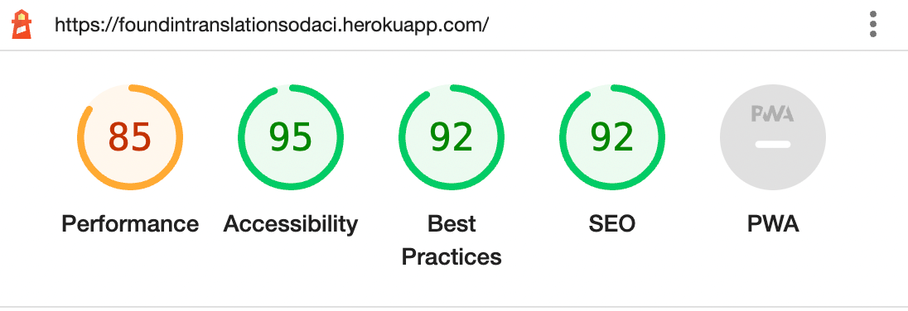
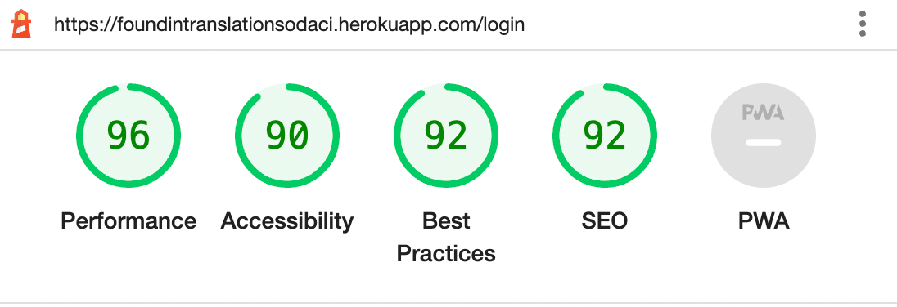
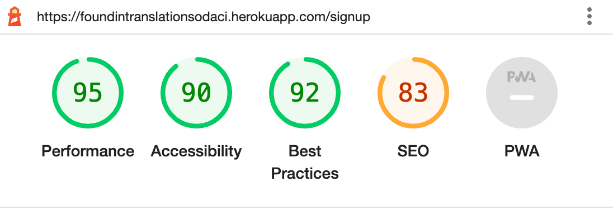
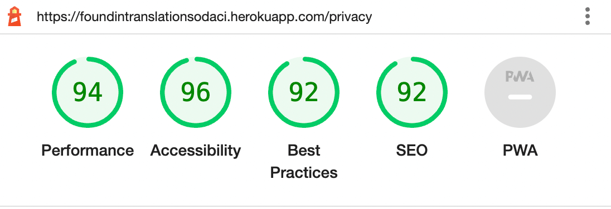

# Found in Translation -  Testing

Responsive site image to go here  

Visit the deployed site: [Found in Translation](https://foundintranslationsodaci.herokuapp.com/)

- - -

## CONTENTS

* [AUTOMATED TESTING](#AUTOMATED-TESTING)
  * [W3C Validator](#W3C-Validator)
  * [JavaScript Validator](#JavaScript-Validator)
  * [Python Validator](#Python-Validator)
  * [Lighthouse](#Lighthouse)
* [MANUAL TESTING](#MANUAL-TESTING)
  * [Testing User Stories](#Testing-User-Stories)
  * [Full Testing](#Full-Testing)

Testing was ongoing throughout the entire build. We utilised Chrome developer tools whilst building to pinpoint and troubleshoot any issues as we went along.

Each page has been inspected using google chrome developer tools & Firefox inspector tool to ensure that each page is fully responsive on a variety of different screen sizes and devices. We have also physically tested the responsiveness of the site on a number of different devices.

- - -

## AUTOMATED TESTING

### W3C Validator

[W3C](https://validator.w3.org/) was used to validate the HTML on all pages of the website. It was also used to validate the CSS.

An error relating to the use of the aria-label on the bootstrap icons was flagged using the validator as being a possible misuse of the label. However this label was taken from the bootstrap icon accessibility section and can therefore be ignored.

* [Index Page](https://validator.w3.org/nu/?doc=https%3A%2F%2Ffoundintranslationsodaci.herokuapp.com%2F)
* [Privacy Page]()

* [style.css](documentation/testing/css-validator.png)

- - -

### JavaScript Validator

[jshint](https://jshint.com/) was used to validate the JavaScript.

* [dropdown.js]()
* [form_validation.js](documentation/testing/form-validation-js.png)
* [language_codes.js](documentation/testing/language-list-js.png)

- - -

### Python Validator

[PEP8](http://pep8online.com/)was used to validate the python files.

* Insert testing results here

- - -

### Lighthouse

I used Lighthouse within the Chrome Developer Tools to test the performance, accessibility, best practices and SEO of the website.

### Desktop Results

* Index Page
  

* Login Page
  
  
* Sign Up Page
  
  
  * All Threads Page
  
  
  * Privacy Policy Page
  
  
  * Terms and conditions Page
  
  
  * 404 Error Page
  

### Mobile Results

* Index Page
  

* Login Page
  
  
* Sign Up Page
  
  
  * All Threads Page
  
  
  * Privacy Policy Page
  
  
  * Terms and conditions Page
  
  
  * 404 Error Page
  
- - -

## MANUAL TESTING

### Testing User Stories

`First Time Visitors`

| Goals | How are they achieved? | Image |
| :--- | :--- | :--- |
| As a first time user, I want to be able to easily navigate the site | We have made every effort to make navigating the site easy for users, regardless of their language. We have achieved this by using icons to represent links. Links for navigation are included in the navbar.  |  |
| As a first time user, I want to be able to sign up to the site and create a profile | Users can create their own profile for the site by using the sign up page. Links to the sign up page are included on the navbar, and there is also a button to redirect users to the sign up page on the 404 page if they are not logged into an account on the site. |  |
| As a first time user, I want to receive feedback that my profile has successfully been created | :--- | :--- |

`Registered/Returning Visitors`

|  Goals | How are they achieved? | Image |
| :--- | :--- | :--- |
| As a returning/registered user, I want to be able to log in to my account | The Navbar has a login link |  |
| As a returning/registered user, I want to be able to view all Threads | Users can view all threads by using the navbar link | :--- |
| As a returning/registered user, I want to be able to create a new post  | :--- | :--- |
| As a returning/registered user, I want to be able to flag offensive posts | :--- | :--- |
| As a returning/registered user, I want to be able to reply to posts | :--- | :--- |

`Admin User`

| Goals | How are they achieved? | Image |
| :--- | :--- | :--- |
| As an admin user, I want to be able to view flagged posts | :--- | :--- |
| As an admin user, I want to be able to delete messages that have been flagged that are offensive | :--- | :--- |
| As an admin user, I want to be able to unflag posts that are not offensive | :--- | :--- |

- - -

### Full Testing

Full testing was performed on the following devices:

* Laptop:
  * Macbook Pro 2021 14 inch screen
* Mobile Devices:
  * iPhone 13 pro.
  * iPhone 11 pro.
  * Phone X.

Each device tested the site using the following browsers:

* Google Chrome
* Safari
* Firefox

Additional testing was taken by friends and family on a variety of devices and screen sizes.  

`Home Page`

Feature | Expected Outcome | Testing Performed | Result | Pass/Fail |
| --- | --- | --- | --- | --- |
| Navbar - Site logo | Reloads home page | Click logo |  Reloads home page | Pass |
| Navbar - Site Name | Reloads home page | Click site name | Reloads home page | Pass |
| Navbar - Home Link | Reloads home page | Click home link | Reloads home page | Pass |
| Navbar - Login Link (user not logged in) | Redirect to Login page | Click log in link | Redirected to log in page | Pass |
| Navbar - Sign up Link (user not logged in)  | Redirect to Sign up page | Click sign up link | Redirected to sign up page | Pass |
| Navbar - View all posts link | Redirects the user to the all threads page | Click view all posts link | Redirected to all posts page | Pass |
| Navbar - Logout link (user logged in) | User will be logged out | Click log out link| Redirected to home page - login link available | Pass |
| View threads button | Redirects to the threads page | Click button | Redirected to the thread | Pass |
| Start a new thread button | Modal popup to create new thread | Click button | New thread modal popped up | Pass |
| Footer - Join now button | Redirects user to the sign up page | Click button | Redirected to sign up page | Pass |
| Footer - Social media links | Opens new tab to the social media site | Clicked each icon | New tabs opened for each site | Pass |
| Footer - Privacy Policy link | Redirects to the privacy policy page | Clicked link | Redirected to privacy policy page | Pass |
| footer - Terms and conditions link | Redirects to the terms and conditions page | Clicked link | Redirected to terms and conditions page | Pass |

`Login Page`

Feature | Expected Outcome | Testing Performed | Result | Pass/Fail |
| --- | --- | --- | --- | --- |
| Navbar - Site logo | Redirects to home page | Click logo |  Redirected to home page | Pass |
| Navbar - Site Name | Redirects to home page | Click site name | Redirected to home page | Pass |
| Navbar - Home Link | Redirects to home page | Click home link | Redirected to home page | Pass |
| Navbar - Login Link (user not logged in) | Reloads Login page | Click log in link | Reloads log in page | Pass |
| Navbar - Sign up Link (user not logged in)  | Redirect to Sign up page | Click sign up link | Redirected to sign up page | Pass |
| Navbar - View all posts link | Redirects the user to the all threads page | Click view all posts link | Redirected to all posts page | Pass |
| Navbar - Logout link (user logged in) | User will be logged out | Click log out link| Redirected to home page - login link available | Pass |
| Form - link to sign up page | Redirects user to sign in page | Click link | Redirected to sign up page | Pass |
| Form - Submission with no information | User prompted to fill in information | clicked submit button with no fields filled out | Form highlighted first empty field | Pass |
| --- | --- | --- | --- | --- |
| Footer - Join now button | Redirects user to the sign up page | Click button | Redirected to sign up page | Pass |
| Footer - Social media links | Opens new tab to the social media site | Clicked each icon | New tabs opened for each site | Pass |
| Footer - Privacy Policy link | Redirects to the privacy policy page | Clicked link | Redirected to privacy policy page | Pass |
| footer - Terms and conditions link | Redirects to the terms and conditions page | Clicked link | Redirected to terms and conditions page | Pass |

`Signup Page`

Feature | Expected Outcome | Testing Performed | Result | Pass/Fail |
| --- | --- | --- | --- | --- |
| Navbar - Site logo | Redirects to home page | Click logo |  Redirects to home page | Pass |
| Navbar - Site Name | Redirects to home page | Click site name | Redirected to home page | Pass |
| Navbar - Home Link | Redirects to home page | Click home link | Redirected to home page | Pass |
| Navbar - Login Link (user not logged in) | Redirect to Login page | Click log in link | Redirected to log in page | Pass |
| Navbar - Sign up Link (user not logged in)  | Reloads Sign up page | Click sign up link | Reloads sign up page | Pass |

| Form - Submission with no information | User prompted to fill in information | clicked submit button with no fields filled out | Form highlighted first empty field | Pass |
| --- | --- | --- | --- | --- |

`New Post Page`

Feature | Expected Outcome | Testing Performed | Result | Pass/Fail |
| --- | --- | --- | --- | --- |

`New Thread Page`

Feature | Expected Outcome | Testing Performed | Result | Pass/Fail |
| --- | --- | --- | --- | --- |

`Threads Page`

Feature | Expected Outcome | Testing Performed | Result | Pass/Fail |
| --- | --- | --- | --- | --- |

`Admin Posts Page`

Feature | Expected Outcome | Testing Performed | Result | Pass/Fail |
| --- | --- | --- | --- | --- |

`Privacy Policy Page`

Feature | Expected Outcome | Testing Performed | Result | Pass/Fail |
| --- | --- | --- | --- | --- |
| Navbar - Site logo | Redirects to home page | Click logo |  Redirects to home page | Pass |
| Navbar - Site Name | Redirects to home page | Click site name | Redirected to home page | Pass |
| Navbar - Home Link | Redirects to home page | Click home link | Redirected to home page | Pass |
| Navbar - Login Link (user not logged in) | Redirect to Login page | Click log in link | Redirected to log in page | Pass |
| Navbar - Sign up Link (user not logged in)  | Redirect to Sign up page | Click sign up link | Redirected to sign up page | Pass |

`Terms and Conditions Page`

Feature | Expected Outcome | Testing Performed | Result | Pass/Fail |
| --- | --- | --- | --- | --- |
| Navbar - Site logo | Redirects to home page | Click logo |  Redirect to home page | Pass |
| Navbar - Site Name | Redirects to home page | Click site name | Redirected to home page | Pass |
| Navbar - Home Link | Redirects to home page | Click home link | Redirected to home page | Pass |
| Navbar - Login Link (user not logged in) | Redirect to Login page | Click log in link | Redirected to log in page | Pass |
| Navbar - Sign up Link (user not logged in)  | Redirect to Sign up page | Click sign up link | Redirected to sign up page | Pass |

`404 Page`

Feature | Expected Outcome | Testing Performed | Result | Pass/Fail |
| --- | --- | --- | --- | --- |
| Navbar - Site Logo | Redirects to home page | Click logo | Redirected to home page | Pass |
| Navbar - Site Name | Redirects to home page | Click site name | Redirected to home page | Pass |
| Navbar - Home Link | Redirects to home page | Click home link | Redirected to home page | Pass |
| Navbar - Login Link (user not logged in) | Redirect to Login page | Click log in link | Redirected to log in page | Pass |
| Navbar - Sign up Link (user not logged in)  | Redirect to Sign up page | Click sign up link | Redirected to sign up page | Pass |
| Navbar - View all posts link | Redirect to the view all posts page | Click view all posts link | Redirected to the All Threads page | Pass |
| Navbar - Logout (user logged in) | Logs the user out of their profile, and redirects to the home page | Click logout link | --- | --- |

Back to [README.md](README.md)